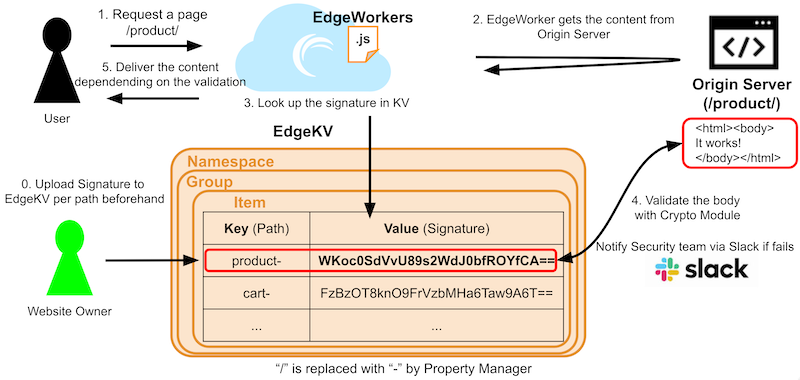
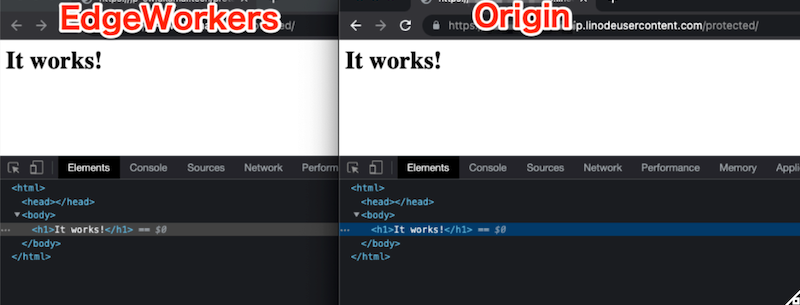
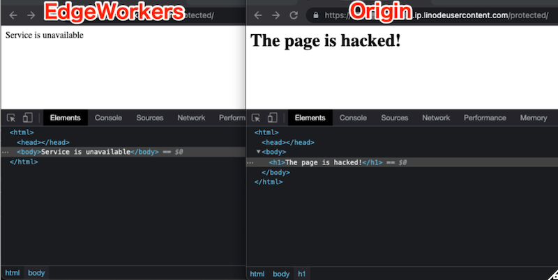
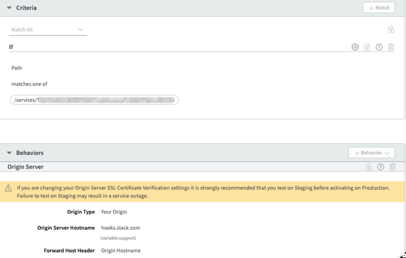

# Website Defacement Protection with Akamai EdgeWorkers/EdgeKV

Akamai Edge Computing Solutions ([EdgeWorkers](https://techdocs.akamai.com/edgeworkers/docs) & [EdgeKV](https://techdocs.akamai.com/edgekv/docs)) validate content to prevent website defacement.

### Benefit

- Server alternative content if a page is falsified
- Get notified with Slack once it’s falsified

### Diagram

### Demo

When a website is normal, Akamai EdgeWorkers pass through the content.

However, if it's falsified, the alternative content is constructed and delivered by EdgeWorkers 

### Note

- To validate a content, [Crypt Built-In module](https://techdocs.akamai.com/edgeworkers/docs/crypto) is used
- To use webhook of Slack, [http-request Built-In](https://techdocs.akamai.com/edgeworkers/docs/http-request) module is used
- It takes around 10 seconds to deploy the KV data on Akamai network ([Inconsistency window](https://techdocs.akamai.com/edgekv/docs/edgekv-data-model))

### How to use a webhook of [Slack](https://api.slack.com/messaging/webhooks) on EdgeWorkers

To send a request to Slack, the property manager of Akamai can configured like attached.

### Resources
* [EdgeKV Documentation](https://techdocs.akamai.com/edgekv/docs)
* [EdgeWorkers Documentation](https://techdocs.akamai.com/edgeworkers/docs)
* [EdgeWorkers API Reference](https://techdocs.akamai.com/edgeworkers/reference/api)
* [Akamai CLI for EdgeWorkers/EKV](https://developer.akamai.com/legacy/cli/packages/edgeworkers.html)
* [EdgeWorkers Developer Page](https://developer.akamai.com/edgeworkers)
* [EdgeKV Product Limits](https://techdocs.akamai.com/edgekv/docs/limits)
